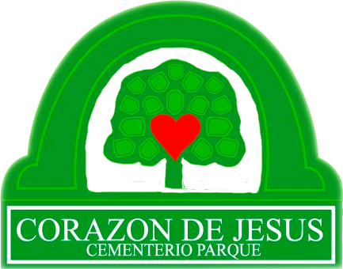

<p align="center">
    
</p>

# Corazón de Jesús - Cementerio Parque

Corazón de Jesús - Cementerio Parque es una aplicación de gestión diseñada para administrar los sectores, lotes y parcelas de un cementerio parque. Esta aplicación permite llevar un registro de las parcelas ocupadas y libres, mejorando la organización y facilitando la administración del espacio.

## Características principales

-   Gestión de sectores, lotes y parcelas.
-   Registro del estado de cada parcela (ocupada o libre).
-   Administración de información relevante de los ocupantes.
-   Implementación en Laravel con Filament y MariaDB para una experiencia de usuario óptima.

## Tecnologías utilizadas

-   **Laravel**: Framework PHP para el desarrollo del backend.
-   **Filament**: Panel administrativo eficiente y fácil de usar.
-   **MariaDB**: Base de datos relacional para almacenamiento de información.

## Instalación

1. Clona el repositorio:
    ```bash
    git clone https://github.com/dothardapp/cparque.git
    ```
2. Accede al directorio del proyecto:
    ```bash
    cd cparque
    ```
3. Instala las dependencias de Laravel:
    ```bash
    composer install
    ```
4. Copia el archivo de configuración de entorno:
    ```bash
    cp .env.example .env
    ```
5. Configura la conexión a la base de datos en el archivo `.env`.
6. Genera la clave de la aplicación:
    ```bash
    php artisan key:generate
    ```
7. Ejecuta las migraciones para crear la base de datos:
    ```bash
    php artisan migrate
    ```
8. Inicia el servidor de desarrollo:
    ```bash
    php artisan serve
    ```

## Contribuir

Si deseas contribuir al desarrollo de esta aplicación, por favor envía un pull request o contacta con el equipo a través del repositorio en GitHub.

## Licencia

Este proyecto es de código abierto y está bajo la licencia MIT.
